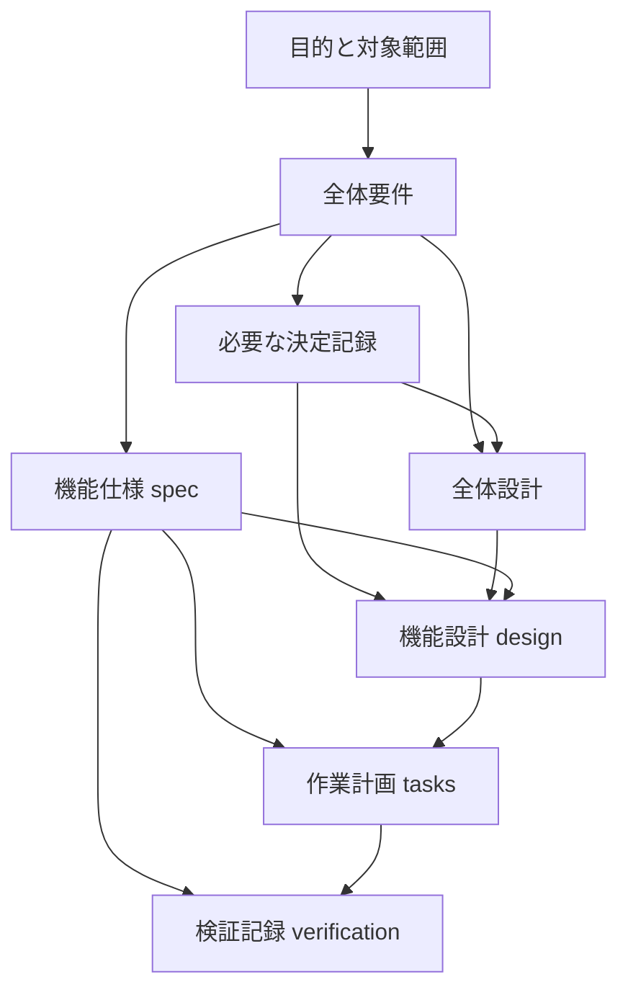

# 文書一覧と依存関係

このページは「何をどこに書くか」と「何を根拠に読むか」の入口です。内容の正本は各リンク先にあります。状態と具体的な依存先も、各文書の冒頭を正本とします。

## 目的別の索引

| 文書 | 書かれていること | 内容の依存先 | 更新するタイミング |
| --- | --- | --- | --- |
| [整頓ルール](guide/file-organization.md) | 配置・命名・状態・移動のルール | なし。運用の基準 | 保存先や運用を変えるとき |
| [開発の進め方](guide/workflow.md) | 試作からの採用、仕様からの実装、完了条件 | 整頓ルール | 開発手順を変えるとき |
| [目的と対象範囲](product/vision.md) | 対象者・困りごと・目指す成果・対象外 | なし。製品の出発点 | 目的や対象者が変わるとき |
| [全体要件](product/requirements.md) | 製品全体の要求・品質・制約 | 目的と対象範囲 | 共通の要求が変わるとき |
| [全体設計](architecture/overview.md) | 構成・技術・境界・共通の設計方針 | 全体要件、採用した決定記録 | 共通の作り方が変わるとき |
| [機能一覧](features/README.md) | 機能文書への入口 | なし。索引 | 機能を追加・移動するとき |
| 機能仕様 `spec.md` | その機能の振る舞いと受入条件 | 全体要件 | 機能の振る舞いが変わるとき |
| 機能設計 `design.md` | 仕様を実現する構成・データ・失敗時の扱い | 機能仕様、全体設計、必要な決定記録 | 実現方法が変わるとき |
| 作業計画 `tasks.md` | 実装手順・作業ごとの完了条件 | 機能仕様、機能設計 | 作業の追加・進捗変更時 |
| 検証記録 `verification.md` | 受入条件とテスト・実行結果の対応 | 機能仕様、作業計画 | 検証するたび |
| [決定記録一覧](decisions/README.md) | 選択肢・採用理由・影響の記録への入口 | 各記録に根拠の要件を記載 | 重要な選択をするとき |
| [廃止文書一覧](archive/README.md) | 廃止理由・旧保存先・後継文書 | なし。索引 | 文書を廃止するとき |

作成済みの機能文書は[機能一覧](features/README.md)から参照できます。新しい機能には[テンプレート](../templates/README.md)をコピーしてください。具体的な依存関係を読める[記入例](../examples/README.md)もあります。

| 補助資料・コード | 役割 | 扱い |
| --- | --- | --- |
| [プロジェクトの入口](../README.md) | 読み方・始め方・開発コマンド | 案内。製品要件を重複させない |
| [Codex向け指示](../AGENTS.md) | Codexが参照する作業ルール | 整頓ルール・開発手順を参照 |
| [テンプレート一覧](../templates/README.md) | 文書の原本とコピー手順 | 原本は仕様として扱わない |
| [記入例](../examples/README.md) | 架空の小機能での書き方 | 実プロジェクトの要件と区別する |
| [試作](../experiments/README.md) | 仮説・コード・試した結果 | 採用内容を仕様へ移してから製品へ反映 |
| [実装](../src/README.md) | 採用したコード | 機能仕様と設計を根拠にする |
| [テスト](../tests/README.md) | 受入条件を確かめるコード | 機能仕様を根拠にする |

## 依存関係図

**矢印 `A → B` は「Bの内容がAを前提にしている」**を表します。Aを変更したら、Bへの影響を確認します。作成順や単なるリンクを表す矢印ではありません。

これは標準形です。追加の依存先は各文書の冒頭に理由とともに書きます。機能固有の決定記録は機能仕様に依存しても構いません。設計から決定記録への参照と、決定記録から設計への「反映先」の案内を、両方向の依存として登録しないでください。

試作メモは、仕様化のきっかけを残す**関連資料**です。採用した条件を機能仕様へ書き直し、試作メモだけに製品の要件を残さないようにします。

## 変更の影響を探す

1. 変更する文書のID・ファイル名・要件IDを確認する。
2. `rg -n --glob '*.md' 'PRODUCT-REQUIREMENTS|requirements\.md' docs experiments` のように参照を探す。対象に応じて検索文字列を置き換える。
3. ヒットした文書の「依存先」を見て、内容が変わるか確認する。単なる関連資料のリンクなら、リンクや説明の更新要否を確認する。
4. 影響する文書・コード・テストを更新する。さらに下流があれば同じ確認を繰り返す。コードやテストの対応は検証記録からたどる。

索引に全ての逆向きリンクを二重管理する必要はありません。人間が各文書の依存先を読めることと、検索で影響先をたどれることを保ちます。
