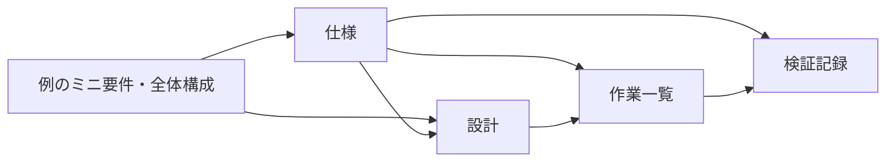

# 記入例：1画面のタスクリスト

| 項目 | 内容 |
| --- | --- |
| 文書ID | EXAMPLE-README |
| 状態 | 記入例（実プロジェクトでの採用・実装なし） |
| この文書に書くこと | 例の背景・要件・構成と、4つの文書を読む順番 |
| 依存先 | なし。この例だけで使う前提をここに定義する |
| 関連資料（補足） | [テンプレート一覧](../templates/README.md)：実際の文書を作るときのひな形 |

このフォルダは書き方を理解するための架空の記入例です。本番の仕様・実装状況として扱いません。
例を参考に実際の文書を作るときは、テンプレートを使い、例の内容・ID・状態をプロジェクトに合わせて書き直します。

## この例だけで使うミニ要件

| 項目 | 内容 |
| --- | --- |
| 想定利用者 | 作業中に短い用事を書き留めたい人 |
| 解決したいこと | ひとつの画面で用事を追加し、済んだ用事を区別したい |
| 最小の成果 | タスク名を追加でき、各タスクの完了・未完了を切り替えられる |
| 保存の範囲 | 開いている画面のメモリだけ。再読み込みすると全件消える |
| 対象外 | ログイン、永続保存、削除、並べ替え、共同編集 |
| 運用上の前提 | 消えて困る情報の記録には使わず、画面にも再読み込みで消える旨を示す |

## この例だけで使う全体構成

- 入力欄・追加ボタン・タスク一覧を1画面に配置する。
- 入力の検証と一覧の更新を、画面側で行う。
- タスクは識別子・名前・完了状態を持つ。外部サービスやデータベースは使わない。
- 技術・ライブラリは未選定。ここにはアプリのコードや実行コマンドを含めない。

## 文書の役割と依存先

「依存先」は、その文書の内容を決める根拠です。依存先が変わったら、下流の文書も見直します。
例えば仕様の上限を100文字から50文字に変えると、設計・作業・検証も同じ上限に直す必要があります。

| 文書 | 書いてあること | 依存先と理由 |
| --- | --- | --- |
| [仕様](features/FEAT-001-task-list/spec.md) | 利用者に提供する振る舞いと受入条件 | この文書：利用者・目的・保存範囲を具体化するため |
| [設計](features/FEAT-001-task-list/design.md) | 画面・データ・入力検証の実現方法 | この文書と仕様：全体構成と要求を満たす方法を決めるため |
| [作業一覧](features/FEAT-001-task-list/tasks.md) | 実装・検証で行う作業と完了条件 | 仕様と設計：必要な作業を取りこぼさないため |
| [検証記録](features/FEAT-001-task-list/verification.md) | 確認手順・期待結果・実際の結果 | 仕様と作業一覧：合否の基準と確認範囲を特定するため |

矢印は **上流（根拠）→下流（それを使う文書）** を示します。

## 追いかけ方

1. 仕様の要求 `EXAMPLE-FEAT-001-R01` と受入条件 `EXAMPLE-FEAT-001-AC03` を読む。
2. 設計で文字数の数え方を確認し、作業一覧で実装・確認する作業を探す。
3. 検証記録で同じ受入条件IDを探し、期待結果と実際の結果を区別する。

現在は記入例だけがあり、作業は未着手、検証は未実施です。期待結果の記載は合格の証拠ではありません。
